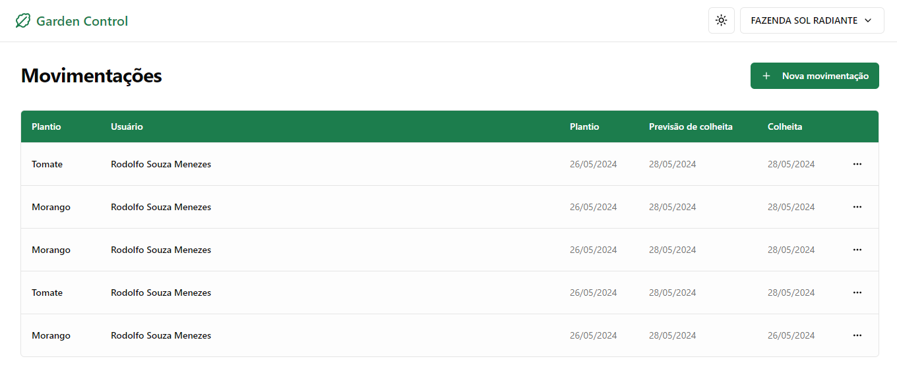

# Garden Control - [VER DEPLOY](https://garden-control-web.vercel.app)

Projeto para controle hortas



## Tecnologias

<p align="start">
  <a href="https://skillicons.dev">
    
    
  </a>
</p>

## Manual de uso

### Inicialiando o servidor - [http://localhost:3333/](http://localhost:3333/)

Nesse projeto usamos as estratégia do JSON Server para simular requisições, siga os camandos abaixo para rodar o servidor:

```sh
npm install
```

```sh
npm run dev:server
```

Você tem a opção do [my-json-server](https://my-json-server.typicode.com) para "hospedar" sua API, nesse caso será necessário criar um arquivo `.env` com a URL do seu projeto:

```sh
## Usando JSON SERVER podemos usar o my-json-server para consumir nosso JSON, 
## Lembrando que ele deve estar nomeado como 'db.json' 
VITE_API="https://my-json-server.typicode.com/seu-github-user/seu-repositorio"
```

### Inicialiando o site - [http://localhost:5173/](http://localhost:5173/)

```sh
npm install
```

```sh
npm run dev
```